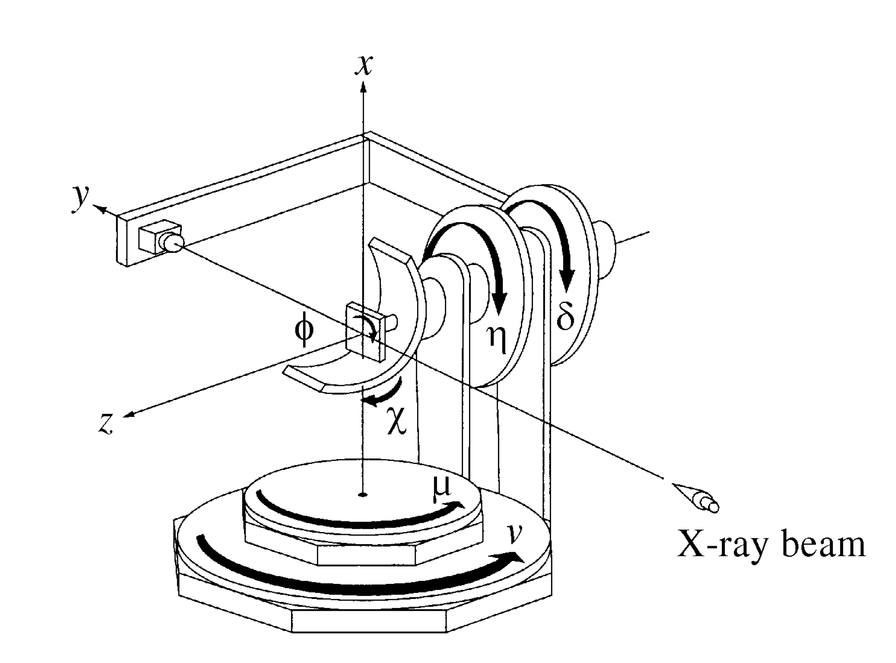

################################
Diffcalc User Guide (You Engine)
################################

.. rubric:: Diffcalc: A diffraction condition calculator for diffractometer control

:Author: Rob Walton
:Contact: rob.walton (at) diamond (dot) ac (dot) uk 
:Website: https://github.com/DiamondLightSource/diffcalc

.. toctree::
   :maxdepth: 2
   :numbered:

See also the `quickstart guide at github <https://github.com/DiamondLightSource/diffcalc/blob/master/README.rst>`_

Introduction
============

This manual assumes that you are running Diffcalc within OpenGDA or have started
it using IPython. It assumes that Diffcalc has been configured for the six
circle diffractometer pictured here:

   4s + 2d six-circle diffractometer, from H.You (1999)

Your Diffcalc configuration may have been customised for the geometry of your
diffractometer and possibly the types of experiment you perform. For example, a
five-circle diffractometer might be missing the nu circle above.

The laboratory frame is shown above. With all settings at zero as shown the
crystal  cartesian frame aligns with the laboratory frame. Therefor a cubic
crystal mounted squarely in a way that the U matrix (defined below) is unitary
will have h||a||x, k||b||y & l||c||z, crystal and reciprocal-lattice coordinate
frames are defined with respect to the beam and to gravity to be (for a cubic
crystal):

Overview
========

The following assumes that the diffractometer has been properly leveled, aligned
with the beam and zeroed. See the `SPEC fourc manual
<http://www.certif.com/spec_manual/fourc_4_2.html>`__.

Before moving in hkl space you must calculate a UB matrix by specifying the
crystal's lattice parameters (which define the B matrix) and finding two
reflections (from which the U matrix defining any mismount can be inferred);
and, optionally for surface-diffraction experiments, determine how the surface
of the crystal is oriented with respect to the phi axis.

Once a UB matrix has been calculated, the diffractometer may be driven in hkl
coordinates. A valid diffractometer setting maps easily into a single hkl value.
However for a diffractometer with more than three circles there are excess
degrees of freedom when calculating a diffractometer setting from an hkl value.
Diffcalc provides modes for using up the excess degrees of freedom.

Diffcalc does not perform scans directly. Instead, Scannables that use diffcalc
to map between reciprocal lattice space and real diffractometer settings are
scanned using the Gda's (or minigda's) generic scan mechanism.

Theory
------

Thanks to Elias Vlieg for sharing his dos based ``DIF`` software that Diffcalc
has borrowed heavily from. The version of Diffcalc described here is based on papers by
pHH. You. [You1999]_ and Busing & Levy [Busing1967]_. (See also the THANKS.txt file.)

Getting Help
============

There are few commands to remember. If a command is called without
arguments in some cases Diffcalc will prompt for arguments and provide sensible
defaults which can be chosen by pressing enter.

**Orientation**. The ``helpub`` command lists all commands related with crystal
orientation and the reference vector (often used with surfaces). See the 
`Orientation Commands`_ section at the end of this manual::

   >>> help ub
   ...

**HKL movement**. The ``help hkl`` list all commands related to moving in reciprocal-lattice
space. See the `Motion Commands`_ section at the end of this manual::

   >>> help hkl
   ...

Call help on any command. e.g.::

   ==> help loadub

Diffcalc's Scannables
=====================

To list and show the current positions of your beamline's scannables
use ``pos`` with no arguments::

   >>> pos

Results in:

**Energy and wavelength scannables**::

    energy    12.3984
    wl:       1.0000

**Diffractometer scannables**, as a group and in component axes (in
the real GDA these have limits)::

    sixc:     mu: 0.0000 delta: 0.0000 gamma: 0.0000 omega: 0.0000 chi: 0.0000 phi: 0.0000
    mu:       0.0000
    chi:      0.0000
    delta:    0.0000
    gamma:    0.0000
    omega:    0.0000
    phi:      0.0000

**Dummy counter**, which in this example simply counts at 1hit/s::

    ct:      0.0000

**Hkl scannable**, as a group and in component::

    hkl:      Error: No UB matrix
    h:        Error: No UB matrix
    k:        Error: No UB matrix
    l:        Error: No UB matrix

**Parameter scannables**, used in some modes, these provide a
scannable alternative to the `Motion`_ section. Some constrain of
these constrain virtual angles::

   alpha:    ---
   beta:     ---
   naz:      ---
   psi:      ---
   qaz:      ---

and some constrain physical angles::

   phi_con:  ---
   chi_con:  ---
   delta_con:---
   eta_con:  ---
   gam_con:  ---
   mu_con:   ---

Crystal orientation
===================

Before moving in hkl space you must calculate a UB matrix by specifying the
crystal's lattice parameters (which define the B matrix) and finding two
reflections (from which the U matrix can be inferred); and, optionally for
surface-diffraction experiments, determine how the surface of the crystal is
oriented with respect to the phi axis.

Start a new UB calculation
--------------------------

A *UB calculation* contains the description of the crystal-under-test,
any saved reflections, reference angle direction, and a B & UB
matrix pair if they have been calculated or manually specified.
Starting a new UB calculation will clear all of these.

Before starting a UB-calculation, the ``ub`` command used to summarise
the state of the current UB-calculation, will reflect that no
UB-calculation has been started::

    ==> ub

A new UB-calculation calculation may be started and lattice specified
explicitly::

    ==> newub 'example'
    ==> setlat '1Acube' 1 1 1 90 90 90

or interactively::

    >>> newub
    calculation name: example
    crystal name: 1Acube
           a [1]: 1
           b [1]: 1
           c [1]: 1
      alpha [90]: 90
       beta [90]: 90
      gamma [90]: 90

where a,b and c are the lengths of the three unit cell basis vectors
in Angstroms, and alpha, beta and gamma are angles in Degrees.

The ``ub`` command will show the state of the current UB-calculation
(and the current energy for reference)::

   ==> ub

Load a UB calculation
---------------------

To load the last used UB-calculation::

   >>> lastub
   Loading ub calculation: 'mono-Si'

To load a previous UB-calculation::

   >>> listub
   UB calculations in: /Users/walton/.diffcalc/i16

   0) mono-Si            15 Feb 2017 (22:32)
   1) i16-32             13 Feb 2017 (18:32)

   >>> loadub 0

Generate a U matrix from two reflections
----------------------------------------

The normal way to calculate a U matrix is to find the position of **two**
reflections with known hkl values. Diffcalc allows many reflections to be
recorded but currently only uses the first two when calculating a UB matrix.

Find U matrix from two reflections::

   ==> pos wl 1
   ==> c2th [0 0 1]
   59.99999999999999

   ==> pos sixc [0 60 0 30 90 0]
   ==> addref [0 0 1]

   ==> pos sixc [0 90 0 45 45 90]
   ==> addref [0 1 1]

Check that it looks good::

   ==> checkub

Generate a U matrix from one reflection
---------------------------------------

To estimate based on first reflection only::

   ==> trialub

Manually specify U matrix
-------------------------

Set U matrix manually (pretending sample is squarely mounted)::

   ==> setu [[1 0 0] [0 1 0] [0 0 1]]

Edit reflection list
--------------------

Use ``showref`` to show the reflection list::

   ==> showref

Use ``swapref`` to swap reflections::

    ==> swapref 1 2
    Recalculating UB matrix.

Use ``delref`` to delete a reflection::

    >>> delref 1

Calculate a UB matrix
---------------------

Unless a U or UB matrix has been manually specified, a new UB matrix will be
calculated after the second reflection has been found, or whenever one of the
first two reflections is changed.

Use the command ``calcub`` to force the UB matrix to be calculated from the
first two reflections.

If you have misidentified a reflection used for the orientation the
resulting UB matrix will be incorrect. Always use the ``checkub``
command to check that the computed values agree with the estimated values::

    ==> checkub

Set the reference vector
-------------------------

When performing surface experiments the reference vector should be set normal
to the surface. It can also be used to define other directions within the crystal
with which we want to orient the incident or diffracted beam.

By default the reference vector is set parallel to the phi axis. That is,
along the z-axis of the phi coordinate frame.

The `ub` command shows the current reference vector, along with any inferred
miscut, at the top its report (or it can be shown by calling ``setnphi`` or
``setnhkl'`` with no args)::

 >>> ub
 ...
 n_phi:      0.00000   0.00000   1.00000 <- set
 n_hkl:     -0.00000   0.00000   1.00000
 miscut:     None
 ...

The ``<- set`` label here indicates that the reference vector is set in the phi
coordinate frame. In this case, therefor, its direction in the crystal's
reciprocal lattice space is inferred from the UB matrix.

To set the reference vector in the phi coordinate frame use::

   >>> setnphi [0 0 1]
   ...

This is useful if the surface normal has be found with a laser or by x-ray
occlusion. This vector must currently be manually calculated from the sample
angle settings required to level the surface (sigma and tau commands on the
way).

To set the reference vector in the crystal's reciprocal lattice space use (this
is a quick way to determine the surface orientation if the surface is known to
be cleaved cleanly along a known axis)::

   >>> setnhkl [0 0 1] ...

Motion
======

Once a UB matrix has been calculated, the diffractometer may be driven
in hkl coordinates. A given diffractometer setting maps easily into a
single hkl value. However for a diffractometer with more than three circles
there are excess degrees of freedom when calculating a diffractometer
setting from an hkl value. Diffcalc provides many for using up
the excess degrees of freedom.

By default Diffcalc selects no mode.

Constraining solutions for moving in hkl space
----------------------------------------------

To get help and see current constraints::

   >>> help con
   ...

   ==> con

Three constraints can be given: zero or one from the DET and REF columns and the
remainder from the SAMP column. Not all combinations are currently available.
Use ``help con`` to see a summary if you run into troubles.

To configure four-circle vertical scattering::

   ==> con gam 0 mu 0 a_eq_b

In the following the *scattering plane* is defined as the plane including the
scattering vector, or momentum transfer vector, and the incident beam.

**DETECTOR COLUMN:**

- **delta** - physical delta setting (vertical detector motion) *del=0 is equivalent to qaz=0*
- **gam** - physical gamma setting (horizontal detector motion) *gam=0 is equivalent to qaz=90*
- **qaz** - azimuthal rotation of scattering vector (about the beam, from horizontal)
- **naz** - azimuthal rotation of reference vector (about the beam, from horizontal)

**REFERENCE COLUMN:**

- **alpha** - incident angle to surface (if reference is normal to surface)
- **beta** -  exit angle from surface (if reference is normal to surface)
- **psi** - azimuthal rotation about scattering vector of reference vector (from scattering plane)
- **a_eq_b** - bisecting mode with alpha=beta. *Equivalent to psi=90*

**SAMPLE COLUMN:**

- **mu, eta, chi & phi** - physical settings
- **mu_is_gam** - force mu to follow gamma (results in a 5-circle geometry)

Diffcalc will report two other (un-constrainable) virtual angles:

- **theta** - half of 2theta, the angle through the diffracted beam bends
- **tau** - longitude of reference vector from scattering vector (in scattering plane)

Example constraint modes
------------------------

There is sometimes more than one way to get the same effect.

**Vertical four-circle mode**::

   >>> con gam 0 mu 0 a_eq_b   # or equivalently:
   >>> con qaz 90 mu 0 a_eq_b

   >>> con alpha 1             # replaces a_eq_b

**Horizontal four-circle mode**::

   >>> con del 0 eta 0 alpha 1   # or equivalently:
   >>> con qaz 0 mu 0 alpha 1

**Surface vertical mode**::

   >>> con naz 90 mu 0 alpha 1

**Surface horizontal mode**::

   >>> con naz 0 eta 0 alpha 1

**Z-axis mode (surface horizontal)**::

   >>> con chi (-sigma) phi (-tau) alpha 1

where sigma and tau are the offsets required in chi and phi to bring the surface
normal parallel to eta. Alpha will determine mu directly leaving eta to orient
the planes. Or::

   >>> con naz 0 phi 0 alpha 1  # or any another sample angle

**Z-axis mode (surface vertical)**::

   >>> con naz 0 phi 0 alpha 1  # or any another sample angle

Changing constrained values
---------------------------

Once constraints are chosen constrained values may be changed directly::

   ==> con mu 10

or via the associated scannable::

   ==> pos mu_con 10

Configuring limits and cuts
---------------------------

Diffcalc maintains its own limits on axes. These limits will be used when
choosing solutions. If more than one detector solution is exists Diffcalc will
ask you to reduce the the limits until there is only one. However if more than
one solution for the sample settings is available it will choose one base on
heuristics.

Use the ``hardware`` command to see the current limits and cuts::

   ==> hardware

To set the limits::

   ==> setmin delta -1
   ==> setmax delta 145

To set a cut::

   ==> setcut phi -180

This causes requests to move phi to be between the configured -180 and +360
degress above this. i.e. it might dive to -10 degrees rather than 350.

Moving in hkl space
-------------------

Configure a mode, e.g. four-circle vertical::

   ==> con gam 0 mu 0 a_eq_b

Simulate moving to a reflection::

   ==> sim hkl [0 1 1]

Move to reflection::

   ==> pos hkl [0 1 1]

   ==> pos sixc

Simulate moving to a location::

   ==> pos sixc [0 60 0 30 90 0]

Scanning in hkl space
=====================

All scans described below use the same generic scanning mechanism
provided by the GDA system or by minigda. Here are some examples.

Fixed hkl scans
---------------

In a 'fixed hkl scan' something (such as energy or Bin) is scanned,
and at each step hkl is 'moved' to keep the sample and detector
aligned. Also plonk the diffractometer scannable (sixc) on there with no
destination to monitor what is actually happening and then
throw on a detector (ct) with an exposure time if appropriate::

    >>> #scan scannable_name start stop step [scannable_name [pos or time]]..

    >>> scan en 9 11 .5 hkl [1 0 0] sixc ct 1

    >>> scan en 9 11 .5 hklverbose [1 0 0] sixc ct 1

    >>> scan betain 4 5 .2 hkl [1 0 0] sixc ct 1

    >>> scan alpha_par 0 10 2 hkl [1 0 0] sixc ct 1

Scanning hkl
------------

Hkl, or one component, may also be scanned directly::

    >>> scan h .8 1.2 .1 hklverbose sixc ct 1

At each step, this will read the current hkl position, modify the h
component and then move to the resulting vector. There is a danger
that with this method k and l may drift. To get around this the start,
stop and step values may also be specified as vectors. So for example::

    >>> scan hkl [1 0 0] [1 .3 0] [1 0.1 0] ct1

is equivilant to::

    >>> pos hkl [1 0 0]
    >>> scan k 0 .3 .1 ct1

but will not suffer from drifting. This method also allows scans along
any direction in hkl space to be performed.

Multidimension scans
--------------------

Two and three dimensional scans::

    >>> scan en 9 11 .5 h .9 1.1 .2 hklverbose sixc ct 1
    >>> scan h 1 3 1 k 1 3 1 l 1 3 1 hkl ct 1

Commands
========

Orientation Commands
--------------------

==> UB_HELP_TABLE

Motion commands
---------------

==> HKL_HELP_TABLE

Good luck --- RobW

References
==========

.. [You1999] H. You. *Angle calculations for a '4S+2D' six-circle diffractometer.*
   J. Appl. Cryst. (1999). **32**, 614-623. `(pdf link)
   <http://journals.iucr.org/j/issues/1999/04/00/hn0093/hn0093.pdf>`__.
.. [Busing1967] W. R. Busing and H. A. Levy. *Angle calculations for 3- and 4-circle X-ray
   and neutron diffractometers.* Acta Cryst. (1967). **22**, 457-464. `(pdf link)
   <http://journals.iucr.org/q/issues/1967/04/00/a05492/a05492.pdf>`__.
